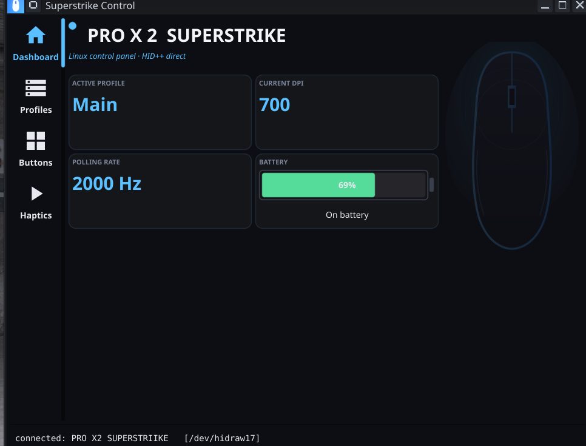

# Linux Superstrike

**A native Linux control app for the Logitech PRO X 2 Superstrike** — the G HUB
features that mouse needs (DPI, polling rate, haptics, button remapping,
profiles), on Linux, in a single self-contained binary. No daemon, no Wine, no
cloud account.



> 🤖 **Fully vibe-coded** — this entire app (protocol reverse-engineering and
> all) was built collaboratively with an AI coding assistant. See
> [`REVERSE_ENGINEERING.md`](REVERSE_ENGINEERING.md) for how the mouse's HID++
> protocol and onboard-profile format were figured out.

## Why this exists

The PRO X 2 Superstrike has no Logitech software on Linux, and existing tools
(Solaar, libratbag) don't yet cover its newer features — especially its
**haptic switches** and its quirky onboard-profile layout. This app talks the
**HID++ 2.0** protocol directly over `/dev/hidraw` and configures the mouse the
same way G HUB does under the hood: by editing its **onboard profiles**, so
your settings apply instantly **and persist on the mouse itself**.

## Features

- **Dashboard** — live device info, active profile, current DPI, **real polling
  rate measured from your actual mouse movement**, and an animated battery gauge.
- **Profiles** — full management of all 5 onboard profiles: per-profile **DPI
  (X/Y)**, **polling rate** (125–8000 Hz), enable/disable, set-active, and rename.
- **Buttons** — remap any button to another **mouse button**, a **keyboard key**
  (with Ctrl/Shift/Alt/Super), a **media key**, a built-in **function**
  (DPI/profile cycle, etc.), or disable it.
- **Haptics** — tune the analog buttons' **click haptics**, **actuation point**,
  and **rapid trigger** (feature `0x1B0C`).
- Clean, themed UI; everything writes to onboard memory and **survives reboots**.

## Install

### Option A — download the release (recommended)

1. Grab the latest `superstrike` binary from the
   [**Releases**](../../releases) page and make it executable:
   ```sh
   chmod +x superstrike
   ```
2. **Grant access to the mouse** (one-time udev rule, so it runs without sudo):
   ```sh
   sudo tee /etc/udev/rules.d/99-logitech-superstrike.rules >/dev/null <<'EOF'
   KERNEL=="hidraw*", SUBSYSTEM=="hidraw", ATTRS{idVendor}=="046d", MODE="0660", TAG+="uaccess"
   SUBSYSTEM=="usb", ATTRS{idVendor}=="046d", MODE="0660", TAG+="uaccess"
   EOF
   sudo udevadm control --reload-rules && sudo udevadm trigger
   ```
   Then replug the receiver (or reboot).
3. Run it:
   ```sh
   ./superstrike
   ```

> The binary is dynamically linked against the standard desktop OpenGL/X11
> libraries (a GUI-toolkit requirement) — present on essentially every Linux
> desktop. If something's missing it'll tell you.

### Option B — build from source

Requires Go 1.23+ and the usual GL/X11 dev headers (for the GUI).

```sh
git clone https://github.com/mclol0/linux-superstrike
cd linux-superstrike
go build -o superstrike .
```

To install it as a desktop app (icon + launcher in your menu):

```sh
./packaging/install.sh
```

## How it works

This mouse ignores the standard *live* DPI/rate setters in firmware — the only
thing that actually takes effect (and what G HUB does) is editing the **onboard
profile** stored on the mouse. So the app:

- speaks HID++ 2.0 directly over `/dev/hidraw` (no `hidapi`/CGO HID dependency);
- reads/writes the profile sectors (DPI, report rate, buttons, RGB), recomputing
  the CRC and verifying the write;
- measures the **true** polling rate by counting HID input reports, because the
  device's rate register reports a stale value.

For the full protocol details — feature table, DPI/rate encodings, the onboard
profile sector layout, haptics, and button format — see
[**`REVERSE_ENGINEERING.md`**](REVERSE_ENGINEERING.md).

## Headless / debugging

The binary doubles as a CLI for diagnostics:

```
superstrike -probe        # device info + full HID++ feature table
superstrike -profiles     # list all profiles + control sectors
superstrike -measurerate  # measure the real report rate (move the mouse)
superstrike -scan         # list Logitech hidraw nodes + HID++ responses
```

## Status & compatibility

- Verified on the **PRO X 2 Superstrike** over the LIGHTSPEED receiver.
- Detection is connection-agnostic (any USB port, the dongle, reconnects). Wired
  and Bluetooth modes should work too; if a mode isn't detected, run
  `superstrike -scan` in that mode and open an issue with the output.

## Credits & disclaimer

Protocol details were informed by the excellent
[Solaar](https://github.com/pwr-Solaar/Solaar) and
[libratbag](https://github.com/libratbag/libratbag) projects.

This is an **unofficial** community tool, **not affiliated with or endorsed by
Logitech**. It writes to your mouse's onboard memory; it's careful (CRC-verified
writes, read-back), but use it at your own risk.

## License

[MIT](LICENSE)
